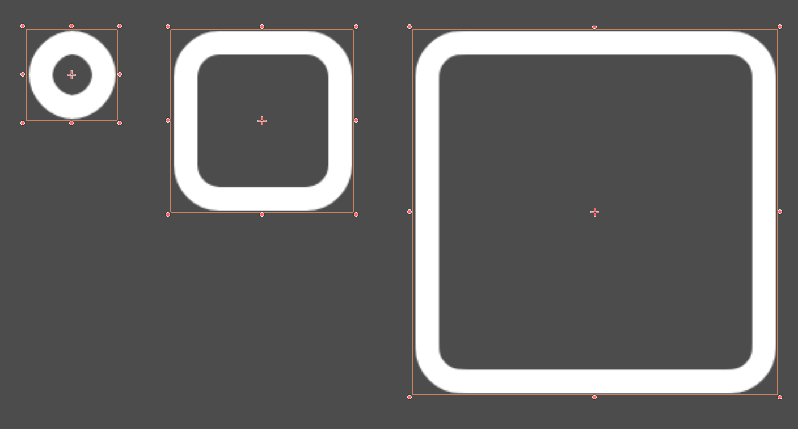

# NinePatchSprite2D — 9-slice Sprite2D for Godot 4
[](LICENSE) [](https://godotengine.org/) [](https://docs.godotengine.org/en/stable/) [](#development-status)

NinePatchRect... for your sprites.

NinePatchSprite2D aims to be an easy-to-use **Sprite2D** subclass that renders **nine-patch** (or "9-slice") sprites via a custom shader. 


It mostly behaves like a normal Sprite2D (modulate, transform...), while allowing borders to remain crisp and the middle to stretch.

---

## Features

- Seamless 9-slice rendering on Sprite2D
- Define insets through normalized UV or pixel values
- Separate, per-edge insets (left/top/right/bottom)
- Scale the borders separately from the sprite
- User-friendly interface through the custom node type



---

## What Does It Do?

See it in action in this brief demonstration over on youtube:

<a href="https://www.youtube.com/watch?v=ueF9o35jEF0" target="_blank">
  
</a>

---

## Installation

1. Copy the folder to your project:
```res://addons/lbg.godot.ninepatchsprite2d/```

2. Enable it in **Project → Project Settings… → Plugins**. Otherwise you won't see the node type when adding a new node to the tree.

3. Add **NinePatchSprite2D** to your scene from the **Create Node** dialog.

---

## Quick Start

1. Assign a texture to the node.
2. Change **Patch Units** if needed:
    - `Pixels` to define the insets as pixels on the texture.
    - `UV Ratio` to use normalized values.
3. Set your border sizes (`patch_left`, `patch_top`, `patch_right`, `patch_bottom`).
4. (Optional) Adjust `border_scale` to thin/thicken the outer tiles without changing relative insets, if needed.
5. (Optional) Toggle `debug_draw_regions` to visualize the 9 regions while editing.

---

## How It Works

- The node owns a `ShaderMaterial` using `nine_patch_sprite2d.gdshader`.
- Exported properties on NinePatchSprite2D are automatically fed into the shader
- `auto_sync_scale` pushes the node’s `scale` into the shader (`sprite_scale`) to counter the scaling of the sprite.
- `modulate` and `self_modulate` are also forwarded to the shader to mimic normal behavior.

---

## API (Exports)

| Property              | Type     | Default | Notes |
|----------------------|----------|---------|-------|
| `debug_draw_regions` | `bool`   | `false` | Editor overlay of the 9 regions. |
| `auto_sync_scale`    | `bool`   | `true`  | Keep shader’s `sprite_scale` in sync with node `scale`. You'll typically want to keep this on. |
| `border_scale`       | `float`  | `1.0`   | Extra scale factor for the **outer** tiles; >1 thickens, <1 thins. |
| `patch_units`        | `int`    | `1 (UV Ratio)`     | `0 = Pixels`, `1 = UV Ratio`. Switching converts existing values to the new unit. |
| `patch_left`         | `float`  | `0.25`  | Inset. Interpreted as pixels or ratio based on `patch_units`. 25% of texture by default. |
| `patch_top`          | `float`  | `0.25`  | Inset. Interpreted as pixels or ratio based on `patch_units`. 25% of texture by default. |
| `patch_right`        | `float`  | `0.25`  | Inset. Interpreted as pixels or ratio based on `patch_units`. 25% of texture by default. |
| `patch_bottom`       | `float`  | `0.25`  | Inset. Interpreted as pixels or ratio based on `patch_units`. 25% of texture by default. |

**Unit conversion behavior**  
When you flip `patch_units`, current inset values are **converted in place** between pixels and UV ratios using the current texture size.

E.g. on a 250px texture, 50px will turn into 0.2 UV ratio when switch, and vice versa.

---

## Limitations

* The node requires the use of a ShaderMaterial using `nine_patch_sprite2d.gdshader` in order to work. This means you cannot easily apply a shader _to_ a NinePatchSprite2D.

---

## License
This project is licensed under the MIT License. See the [LICENSE](LICENSE) file for details.

---

## Author
Jean-Marie Prévost  
[https://github.com/JeanMariePrevost](https://github.com/JeanMariePrevost)
